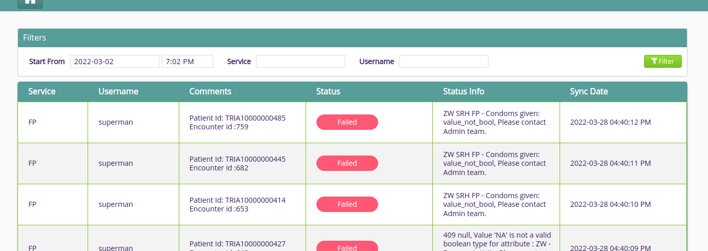
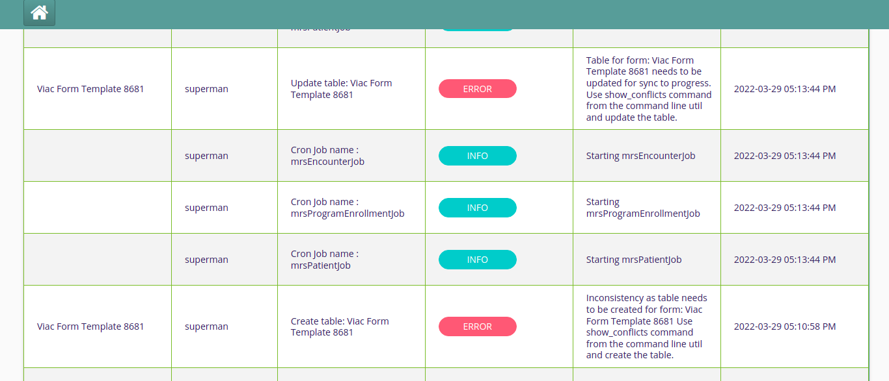
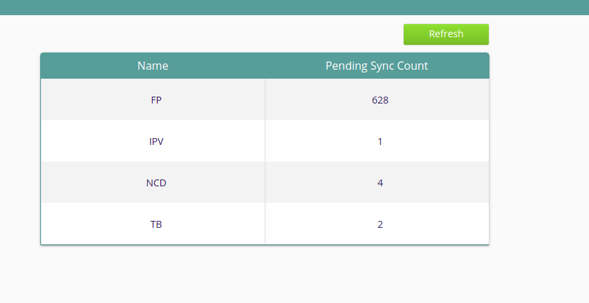

# bahmni-dhis2-integration-service
This project is used to handle DHIS sync related activities, including mapping of form table columns to corresponding DHIS2 data elements, and logs of sync and flattening processes.

- All the form we need to flatten should have their mappings entered from the `Manage Mapping` frontend.
- Each mapping corresponds to a DHIS program stage.
- Inside each mapping, we will need to set a DHIS program stage ID, this is an autoselect.
- After that we will need to add all the form tables corresponding to that program stage. We need to enter atleast 3 characters in the table searchbox for the autocomplete to work.
- The tables will be named similar to the form name, all lowercase and spaces will be replaced wih underscores eg: for form Prep Screening Tool, the table name will be prep_screening_tool.
- At least one mapping should be entered for each table for the mapping to be saved.
- The patient mapping is also present as a separate mapping in the `Manage Mapping' page.

###Mapping

###Sync Logs
This page displays the logs corresponding to DHIS Sync. 

###Analytics Logs
This page displays the logs for flattening. 

###Pending Sync
This page displays the count of events left to synced to DHIS.

##Building the RPM:
Run `mvn clean install -DskipTests`. (Ignore errors and warning if any)
The RPM will be created in `target/rpm/bahmni-dhis2-integration-service/RPMS/noarch`
